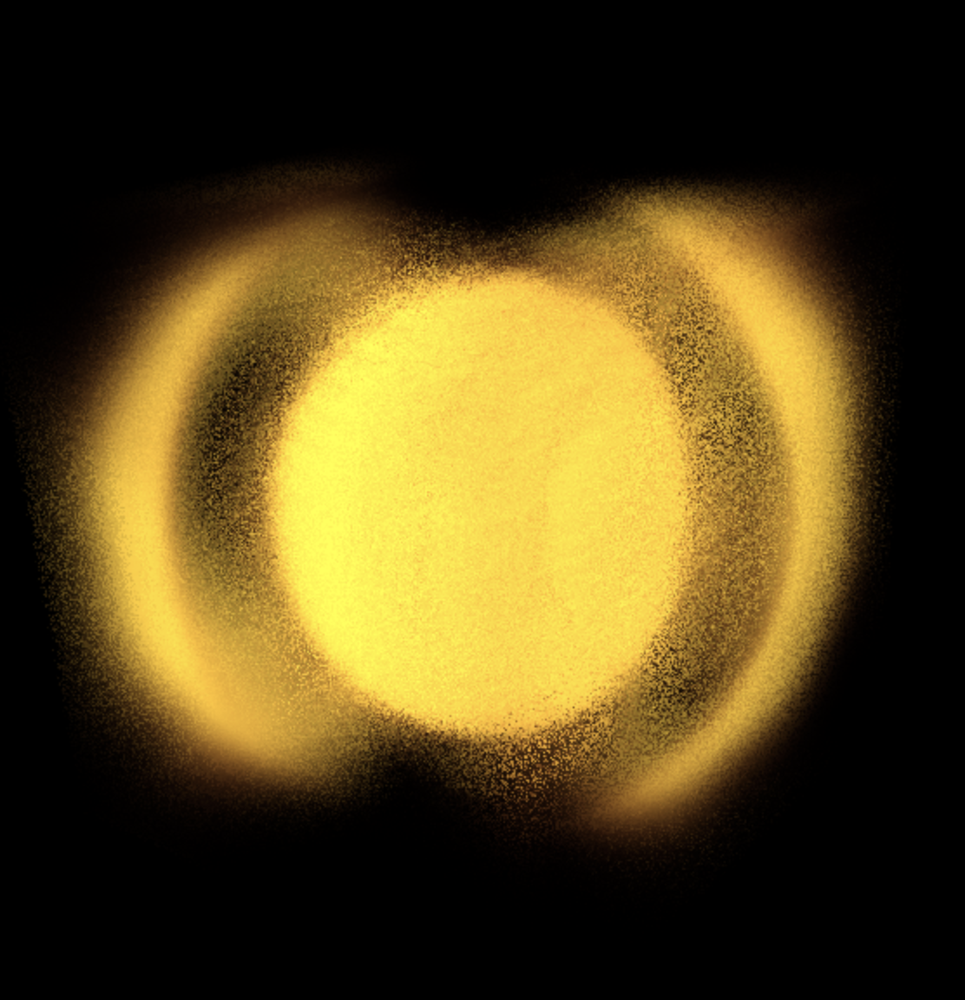

# Cardia Engine
**A Non-Newtonian Lattice Boltzmann Engine for Topological Molecular Dynamics & Foundational Physics**

Cardia is a highly parallelized, 3D weakly compressible fluid dynamics solver built to simulate spacetime not as an empty geometric vacuum, but as the macroscopic hydrodynamic limit of a quantum superfluid. 

By modeling the true vacuum as a non-linear field that condenses into **Ichor**—a ballistic, acoustic, non-Newtonian quadratic dispersion fluid—Cardia bridges the gap between classical fluid dynamics, cosmological structure formation, and quantum field theory. This condensed discrete fluid functions as the structural Higgs field, explicitly breaking the QM/MM (Quantum Mechanics / Molecular Mechanics) computational bottleneck by modeling fundamental particles and their interactions as deterministic, topological fluid structures.

## 🌌 Theoretical Foundation

Cardia abandons the standard $\Lambda$CDM collisionless particle model and standard probabilistic quantum mechanics in favor of a **deterministic continuum approach**. The core physical constraints of Ichor are derived directly from the most stringent astrophysical observations:

* **The Continuum-Discrete Paradox and Quadratic Dispersion:** Gamma-ray burst GRB 090510 placed an extraordinary limit on vacuum photon dispersion. Assuming a continuous spatial manifold ($a \to 0$) triggers catastrophic ultraviolet divergences ($\int d^4k \to \infty$), requiring probabilistic randomness. Conversely, instituting a rigid, deterministic spatial lattice with linear ($n=1$) kinematic friction forces a sub-Planckian grid ($\lesssim 1.35 \times 10^{-35}\text{ m}$), which violently violates the Bekenstein informational capacity bound. 
* **The Ichor Resolution:** We resolve this paradox using Grigory Volovik’s emergent gravity framework. Ichor behaves as the macroscopic hydrodynamic limit of a quantum superfluid (analogous to $^3\text{He-A}$). The topology of this superfluid physically protects the energy spectrum; time-reversal and inversion symmetries in the effective action perfectly cancel $O(p^3)$ linear dispersion terms. The leading-order kinematic correction is mathematically forced to be ballistic and quadratic ($n=2$):
  $$E^2 \approx p^2c^2 \pm \frac{p^4 c^4}{M_{\text{QG}}^2}$$
* **UHECR Acoustic Opacity:** Applying this fluid-derived quadratic dispersion relation to the Fermi data accommodates the sub-second arrival window and expands the structural lattice scale to a macroscopic upper bound of $L_{node} \lesssim 1.22 \times 10^{-26}\text{ m}$. This geometric bound perfectly aligns with a structural Nyquist cutoff, acting as an acoustic opacity limit that seamlessly predicts the maximum energy threshold of ultra-high-energy cosmic rays (e.g., the Fly's Eye anomaly).
* **GUT-Scale Condensation:** The true vacuum operates as a non-linear field that condenses the discrete Ichor fluid almost instantly. Resolving this field to absolute structural stability forces a fundamental spatial lattice spacing of $1.0 \times 10^{-32}\text{ m}$. This node size perfectly aligns with the convergence of the weak, strong, and electromagnetic forces, independently deriving the canonical $10^{16}\text{ GeV}$ Grand Unified Theory (GUT) scale from purely mechanical boundary conditions.
* **High-Entropy Clumping (JWST Resolution):** Replaces hierarchical Newtonian accretion with a Kibble-Zurek phase transition. As the universe cools across a critical threshold, the high-entropy clumping and non-linear shear-thickening of Ichor trigger a direct-collapse event, explicitly predicting the rapid formation of supermassive early galaxies observed by the James Webb Space Telescope (JWST).
* **Emergent Gravity (The Bjerknes Force):** Recovers the geometric curvature of General Relativity strictly through acoustic shadowing. Because the Ichor fluid is saturated with high-frequency ZPE waves, a massive, dense topological defect acts as an acoustic sink. The isotropic background pressure on the far side of surrounding matter becomes significantly greater, mechanically pushing it toward the central mass as a deterministic acoustic push rather than a geometric pull.

## ⚙️ Engine Architecture

Cardia is written in Rust and executes on the GPU via WGSL (WebGPU Shading Language), engineered for extreme scale and numerical stability.

* **D3Q39 Lattice Boltzmann Method:** Uses a high-resolution 39-velocity discrete lattice to maintain perfectly isotropic fluid dynamics and tensor stability at extreme shear rates.
* **True A-A Streaming (Race-Free):** Implements a split-memory read/write layout (`f_grid_low` and `f_grid_high`) to guarantee hardware cache alignment and prevent data races during parallel shader execution.
* **Recursive Regularization (RLBM):** Operates on a 3rd-Order Hermite Manifold to reconstruct ghost modes and maintain stability without artificial numerical damping.
* **Dynamic ZPE Field:** Generates infinite, continuous stochastic vacuum fluctuations using a Murmur3 avalanche hash for independent axial decorrelation, eliminating the Marsaglia effect.
* **Relativistic Mach Clamp:** Enforces the speed of light ($c_s$) organically. As localized velocity increases, relativistic Lorentz scaling drives the apparent viscosity to infinity, preventing lattice fracture purely through Minkowski hydrodynamics.

## 🧬 Topological Molecular Dynamics (The QM/MM Resolution)

Standard computational chemistry cannot natively simulate bond breaking across millions of atoms without relying on computationally crippling Density Functional Theory ($O(N^3)$). Cardia scales linearly ($O(N)$) while maintaining true quantum reactivity.

* **Topological Matter (Quarks & Gluons):** Fundamental particles are projected into the grid as macroscopic, $SU(3)$-symmetric Trefoil solitons. The three interlocking topological lobes geometrically represent the localized momentum loops of three constituent valence quarks (2 up, 1 down for a proton). The fluid's thermodynamic surface tension structurally confines these loops, acting as the macroscopic continuum analog to the strong nuclear force (gluon field). Mass is the measurable hydrodynamic drag a knot experiences moving through the condensed Ichor fluid (the Higgs field).
* **Acoustic Orbitals:** Electrons are not probabilistic point-clouds. As the Trefoil core spins, it scatters incoming ZPE waves into spherical harmonic standing waves, generating spatial atomic orbitals via acoustic interference.
* **Deterministic Entanglement & Catalysis:** Chemical bonds form when localized acoustic resonance shells overlap and lock. Chemical reactions (catalysis) are simulated as literal topological reconnection events driven by fluid shear and Shan-Chen surface tension, allowing for true transition-state modeling of covalent drug binding and protein folding.

## 📊 Telemetry, Diagnostics, and Cosmological Nucleation

Because Cardia abandons probabilistic equations in favor of deterministic fluid dynamics—measuring the variance of the condensed Ichor fluid that functions as the Higgs field—extracting quantum observables requires measuring the macroscopic variance of the fluid substrate.

The engine's initial boundary conditions are derived from the unspooling of a spinning Big Bang black hole core. The extreme angular momentum of this progenitor generates the primordial **chiral pumps**. As the macroscopic fluid volume expands, **Temperature** acts as the master dynamic variable. Local thermal data directly dictates the Zero-Point Energy (ZPE) amplitude and the non-Newtonian viscosity. When the temperature drops across the critical threshold, nucleation sites fold, collide, and condense, freezing the fluid's shear into stable topological matter.

To capture this without bottlenecking the simulation, Cardia utilizes a highly optimized **Parallel Map-Reduce Compute Pipeline** written in WGSL and orchestrated via Rust. The engine executes a true A-A race-free diagnostic fetch across the $O(N)$ lattice, reducing millions of voxels into a single `GpuMetrics` struct per tick, which is then mapped into real-world physical constants.

### Core Observables Tracked

* **Fundamental Mass & Relativistic Limits (The Higgs Drag):** Measures the Ginzburg-Landau (Madelung) binding energy of the localized Trefoil knot as it moves through the Ichor fluid. Dynamically compares the fluid's emergent rest mass ($E=mc^2$) against the empirical mass of a physical proton ($1.6749 \times 10^{-27}\text{ kg}$).
* **Topological Nucleation & Fluid Dynamics:** Integrates 3D vorticity fields to verify the structural knottedness of the momentum loops generated during high-temperature nucleation collisions. Tracks quantized vortex shedding and the Casimir acoustic pressure differential inside the Trefoil core.
* **Acoustic Orbitals & Clumping Rates:** The GPU extracts the continuous spatial variance ($\psi^2$) of the acoustic standing waves across 120 high-resolution radial bins. This explicitly maps the spatial electron $s$-orbitals, and can be transformed via FFT to extract cosmological power spectra (Matter Power Spectrum/CMB).
* **Emergent Gravity & Flux Fields:** Measures the localized Bjerknes Force—the net inward acoustic push (`g_measured`) and radial `gravitational_flux` caused by the topological knot casting a low-pressure ZPE shadow in the surrounding fluid matrix.
